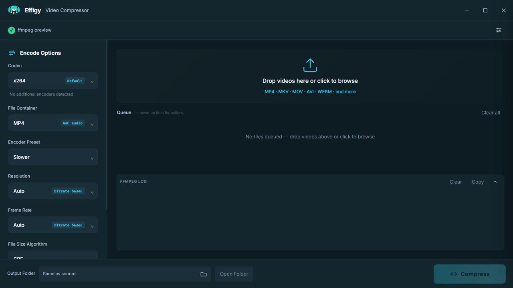
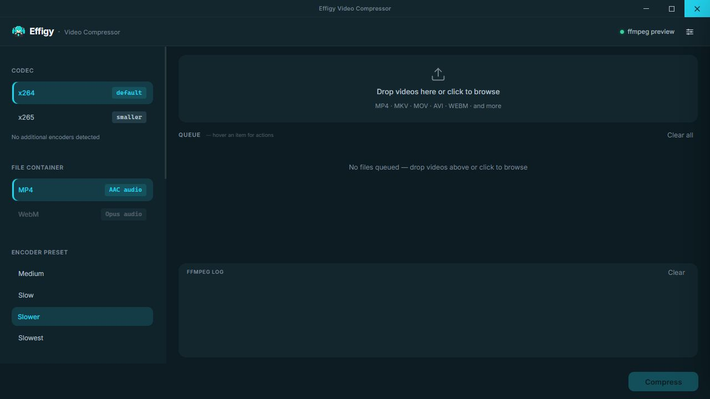

<div align="center">
  
  <h1>Effigy Video Compressor</h1>
  <p>A fast, focused Windows video compressor with strict file-size targeting and automatic hardware-encoder detection.</p>
  <p>
    <a href="https://github.com/JosEffigy/effigy-video-compressor/releases/latest"><strong>Download the latest release</strong></a>
    ·
    <a href="CHANGELOG.md">Changelog</a>
    ·
    <a href="CONTRIBUTING.md">Contributing</a>
  </p>
</div>

Effigy combines a Svelte interface with a Rust/Tauri backend and FFmpeg. Videos stay on your PC, and the app exposes only the hardware encoders that successfully initialize on the current system.

## Screenshots

| Modern | Simple |
| --- | --- |
|  |  |

## Download and run

1. Download `effigy-video-compressor-v2.1.2.zip` from [Releases](https://github.com/JosEffigy/effigy-video-compressor/releases).
2. Extract the ZIP to a writable folder.
3. Run the versioned executable, such as `effigy-video-compressor-v2.1.2.exe`.
4. If FFmpeg is unavailable, use the in-app installer to download the checksum-verified Full build.

The release is portable. Keep `finish.wav` beside the executable if you want the completion sound.
The included `finish.wav` is an original synthesized notification tone and contains no third-party audio sample.

## Features

- CPU encoding with x264, x265, and SVT-AV1
- Automatic NVIDIA NVENC, AMD AMF, and Intel QSV detection
- GPU names shown next to supported hardware encoders
- MP4 with AAC audio and WebM with Opus audio
- Fixed target-size encoding or dynamic CRF/perceptual-quality control
- Automatic two-pass ABR with VBV constraints for fixed-size x264/x265, plus two-pass ABR for SVT-AV1
- Resolution, frame-rate, quality, and encoder-preset controls
- Adaptive AAC/Opus audio bitrate based on the available file-size budget
- Fixed-mode Auto resolution and FPS selection based on bitrate and sampled motion complexity
- Fixed-MB gameplay allocation with Lightweight full-video motion analysis or a more precise constant-quality Probe mode
- Multi-file queue with per-file cancellation and progress
- Modern and Simple themes, light/dark/system appearance, and custom accent colors
- Optional start-on-add, minimize-to-tray, open-folder-on-finish, and encoder-setting persistence
- Single-instance behavior and automatic cleanup of FFmpeg child processes
- Selectable FFmpeg log with copy and clear actions

## Supported rate control

| Mode | Encoder behavior |
| --- | --- |
| Fixed size | Two-pass ABR with VBV constraints for x264/x265; SVT-AV1 uses two-pass ABR because it rejects VBV in ABR mode; hardware encoders use their multipass/constrained-VBR equivalent; every encoder gets hard-limit verification and automatic correction |
| Dynamic | CRF for software encoders and the closest vendor perceptual-quality mode for hardware encoders |
| NVENC | Full-resolution multipass constrained VBR for fixed size; CQ-VBR for dynamic quality |
| AMF | Peak-constrained VBR for fixed size; QVBR for dynamic quality when the driver initializes it, with an automatically detected hardware-quality fallback otherwise |
| QSV | Bitrate-constrained VBR for fixed size; ICQ/global-quality for dynamic quality |
| SVT-AV1 | Two-pass ABR for fixed-size targets, followed by hard-size verification and correction |

## Gameplay allocation

Gameplay allocation choices appear only in Fixed-MB mode for encoders other than SVT-AV1. `Lightweight` is the default and scans motion across the full video. `Probe-based` additionally creates a temporary low-resolution constant-quality encode and measures the bits each scene requires at that quality. SVT-AV1 always uses Lightweight motion analysis for Auto resolution/FPS and skips the extra quality probe.

- x264 and x265 receive normalized native bitrate zones while retaining two-pass ABR/VBV and the global size budget.
- SVT-AV1 retains native two-pass ABR with preset 6 by default, VQ tuning, AQ2, variance-boost strength 2, and `ac-bias=1.0`. It encodes the video continuously without separate scene budgets or per-picture QP maps.
- NVENC, AMF, and QSV do not expose arbitrary time-range bitrate zones through FFmpeg. Effigy tests and enables their closest supported hardware path: lookahead/AQ for NVENC, pre-analysis/temporal AQ/high-motion boost for AMF, or extended bitrate control/lookahead for QSV.
- Every path still receives final hard-size verification and automatic bitrate correction.

Hardware options are tested at runtime, so an encoder is hidden if FFmpeg or the installed driver cannot initialize it.

## Requirements

- Windows 10 or Windows 11
- [Rust](https://rustup.rs/) with the MSVC toolchain
- [Node.js](https://nodejs.org/) 22 or newer
- [pnpm](https://pnpm.io/installation)
- Microsoft Edge WebView2, normally included with current Windows versions
- FFmpeg and FFprobe on `PATH`, beside the executable, or installed through Effigy

## Development

```powershell
pnpm install
pnpm tauri dev
```

Run the project checks:

```powershell
pnpm build
cd src-tauri
cargo fmt --check
cargo clippy --all-targets -- -D warnings
```

## Release build

```powershell
pnpm release
```

This rebuilds the app, writes Cargo artifacts only to `build/cargo-target`, then recreates the distributable layout below. The release folder never receives dependency trees, Cargo output, source icons, or other build artifacts.

```text
release/
├─ effigy-video-compressor-v2.1.2/
│  ├─ effigy-video-compressor-v2.1.2.exe
│  └─ finish.wav                 (when present in the project root)
└─ effigy-video-compressor-v2.1.2.zip         (contains the folder above)
```

## FFmpeg lookup order

Effigy looks for `ffmpeg.exe` and `ffprobe.exe` in this order:

1. Beside the Effigy executable
2. The managed per-user installation at `%LOCALAPPDATA%\Programs\FFmpeg\bin`
3. The system `PATH`

The in-app installer downloads the checksum-verified FFmpeg Full release build from [gyan.dev](https://www.gyan.dev/ffmpeg/builds/). It stores the binaries in `%LOCALAPPDATA%\Programs\FFmpeg\bin` and adds that neutral directory to the user `PATH` when needed. The Full variant includes SVT-AV1 in addition to the encoders provided by Essentials.

## Portable settings

Effigy creates `effigy-video-compressor.cfg` beside the executable. Appearance and behavior preferences are always persisted. Encoder choices are restored only when **Remember encoder settings** is enabled. The output folder is session-only and always resets to **Same as source** when Effigy starts.

To reset the app, close Effigy and remove `effigy-video-compressor.cfg`. It will be recreated with x264, CRF 24, Slower, Auto resolution, Auto FPS, and MP4 as the first-launch encoder defaults. Version 1 settings automatically migrate the previous CQP value to CRF.

## Optional completion sound

Place a file named `finish.wav` beside the executable to play it after a compression batch finishes.

## Project structure

```text
src/                    Svelte UI, styles, themes, and controller
src-tauri/src/lib.rs    FFmpeg, hardware detection, process safety, and Tauri commands
src-tauri/icons/        Canonical PNG and Windows ICO application icons
src-tauri/tauri.conf.json
```

The canonical source icon is `src-tauri/icons/icon.png`. Regenerate platform icons with `pnpm tauri icon <square-image.png>` if needed.

## Contributing

See [CONTRIBUTING.md](CONTRIBUTING.md) for the development and validation workflow.

## License

No open-source license has been selected yet. All rights are reserved by the project owner.
